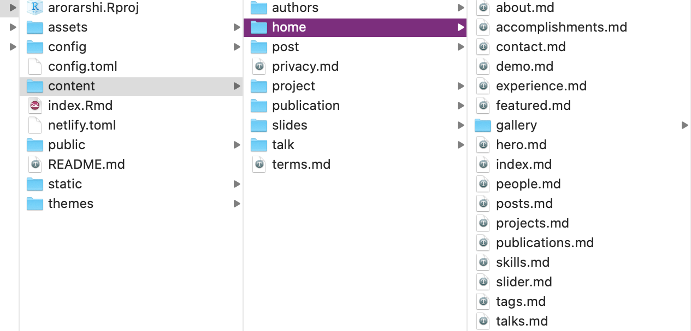

```{r setup, include=FALSE}
knitr::opts_chunk$set(collapse = TRUE)
```

Setting up a personal website is fun and a great way to reach visibility. Whether its your work, skills, or other hobbies, they all can reach the light of day in one platform! 

I will go over building websites via [blogdown](https://bookdown.org/yihui/blogdown/) as [Hugo's Acadmeic](https://themes.gohugo.io/academic/) theme as a template. Though Yihui's blogdown tutorial is the ultimate Holy Grail. I wanted to write a simple tutorial about getting  started with a quick and easy website without getting overwhelmed :) 

# 0. Getting Started 

By running the following commands in R: 

```{r, echo=T, eval=FALSE}
#set up
install.packages('blogdown') 
library("blogdown")
blogdown::install_hugo()
#start creating a website by new_site()!
blogdown::new_site(theme = "gcushen/hugo-academic")
#I have passed the academic theme above

#view your website locally
blogdown::build_site()
```

OK. This created a bunch of files in your directory, and created a static website, something like [this](https://themes.gohugo.io/theme/academic/)

This is an exhaustive overview of how the Academic template looks like. We don't need all of these functionalists, and we can retain only what we like. 

If you mess up something, original GitHub code is available [here](https://github.com/gcushen/hugo-academic/tree/master/exampleSite) for your reference. 

#1. What's going on? 
A lot! 

First place I would recommend trying is 
getting familiar with `.md` files present here `your website folder > content > home`

{#id .class width=50% height=50%}

Each .md file here is a functionality/widget of the Academic theme. For example, you see skills section of the website in a particular icon format, experience section in a bullet-timeline format, and so on. They are all controlled by the files here, and are displayed by logical `active=true/false` as follows- 

```{r, echo=TRUE, eval=FALSE}
# About widget.
widget = "about"  # See https://sourcethemes.com/academic/docs/page-builder/
headless = true  # This file represents a page section.
active = true  # Activate this widget? true/false
#
```

If `active=FALSE` widget is suppressed and displayed if `TRUE`. Start by turning everything `FALSE` except - 

* `about.md` 
*  `skills.md`
*  `experience.md`

Also, note the `weight` section in the `.md` script. This is the order in which widgets will get displayed on your website. For example, the bubbles image background at the very top has `weight=1` as seen in `slider.md`. 

#2. Getting the hang of it? 

After turning off all the widgets, except `about.md, skills.md` and `experience.md` (you don't have to delete others, and might want to store them for later). You will have the bare bones of your website. 

Now start filling in some details. 
The `about.md` file points to `content -> authors -> admin -> _index.md` file, from where it stores and displays all that information. Fill it up with your own deets! 

Same goes for `skills.md` and `eperience.md` 

#3. config.toml and config folder

I use `config.toml` for all my settings, and as the name says `config` details. Remaining stuff like menu details go to `config -> _default -> menus.toml`, and `params.toml` for all website settings like theme, color, and other settings. (You won't need a lot to start with)

## menus.toml 

This is the easy part! This just contains the menu buttons you want to see at the top of your website. Though everything is published on your website in a long-ish format. Here, the menu buttons at the top will help your viewer to navigate to key sections. Use the widgets you want to appear here like follows:

```{r, echo=TRUE, eval=FALSE}
[[main]]
  name = "Projects"
  url = "#projects"
  weight = 30
  
[[main]]
  name = "Posts"
  url = "#posts"
  weight = 40

  # and so on
```

In my website `about` and `skills` are at weight `10` and `20`, and that's why `projects` has weight `30`. Menu items follow the same order and weights as the widgets as well. You can change that! Weights here just determine the order of appearance in the `menu` section. 

## config.toml

Here, I have everything as default except-  

```{r, echo=TRUE, eval=FALSE}
baseurl = "https://arorarshi.rbind.io/"
title = "Arshi Arora"
copyright = 

paginate = 10  # Number of items per page in paginated lists.
enableEmoji = true

sharing = true

#fixing image in posts 
#this just puts the image used in your rmarkdown posts to appropriate folder, so that it doesn't appear broken on website. confused? you can skip for now. 
uglyurls = true
#[permalinks]
# post = "/:year/:month/:day/:slug/"

[blackfriday] bit
#this is only needed for .md files. Pandoc is better for .Rmd. Maybe remove later but for now I have it in. 
```

## params.toml
For a basic setup, you don't need to worry about this. 

#4. Rinse and Repeat
Keep adding interesting details about yourself and playing around with the widgets. I will add deployment and other intricate details in the next post! 


# References
1. https://bookdown.org/yihui/blogdown/
